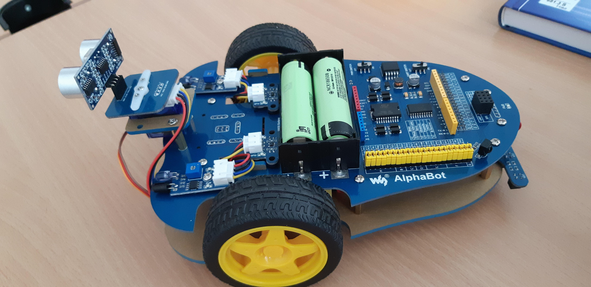

<!--
author:   Abeer Abusobaih

email:    aabusobaih@gmail.com

version:  0.0.1

language: en

narrator:  US English Female

comment:  Try to write a short comment about
          your course, multiline is also okay.

import: https://raw.githubusercontent.com/liascript/CodeRunner/master/README.md

@run: @LIA.eval(`["main.c"]`, `gcc -Wall main.c -o a.out`, `./a.out`)

-->

# About the Course

Welcome this course is given by : Prof. Dr. Sebastian Zug, Technical University Bergakademie Freiberg

This course was created with LiaScipt. The interactive view of this course is available at the following [Link]()

<br/>

**Course Goal**

This course is introduction to Robot, AlphaBot used as example to explain everything related to Robot. The main goal of this course is creating devices. It is difficult to engage in the creation of devices in theory, you have to implement your projects. To achieve this goal, you will get acquainted with a variety of electronic components, programming techniques and approaches to work.

<br/>

**How to take this course ?**

- Lectures.

- Additional materials.

- Practice and exercises.

<br/>

**Test**

<br/>

**Additional Information**

For those who want to learn more about robot, I have given links to materials that will allow you to expand your knowledge.

A book about electronics --> Charles Platt. Make: Electronics  [amazon.com](https://www.amazon.com/Make-Electronics-Learning-Through-Discovery/dp/1680450263/ref=sr_1_1?ie=UTF8&qid=1505854474&sr=8-1&keywords=Make%3A+Electronics)
<br/>

**What courses would be covered through this Robot?**

1. Algorithm.

2. Software development.

3.

**Communication **


## Introduction
<br/>


The steps need to learn programming and electronics to be able to build an AlphaBot?

1. First step you need to learn a Programming language. The best programming language is C programming language, C is the language that used to communicate with electronics and hardware. C is also used to program an Arduino board. C is the preliminary to learn C++, which C++ the most use programming language in Robotics.

2. Second step to learn about Electronics, you can learn electronics using an Arduino board. [Arduino Course](https://liascript.io/course/?https://raw.githubusercontent.com/abusobaih/LiaScript/master/course.md#1)

3. The last step is build and program a Robot.

<br/>

The triangle of learning a Robotics.


**What is AlphaBot ?**

AlphaBot is a mobile robot development platform, compatible with Raspberry Pi/Arduino. You can get started with robotic development like line tracking, obstacle avoidance, IR remote control and video monitoring vis network.

This course is based on Arduino because this platform is learner, and user-friendly. Arduino board has a significant number of existing modules and there is a possibility to create your own modules.

Course covers all details related to this robot :


<br/>



<br/>


## What you need before you can learn ?

Let's imagine that a controller is a box and this box has some space to store data and also instructions. The controller follows the instructions, which are coded in zero and ones, the same as the data. These instruction is stored as computer code. So because many people cannot write computer codes, programming languages were founded to translate between human languages that  we speak to the set of instructions written in one and zero that devices can understand.

All digital devices work with data which is coded in binary code.

To program a device, first you have to define an algorithm, or a sequence of activities and actions that the device is going to perform. Then transfer this algorithm in a familiar language. Then following the rules of the programming languages to translate it.

The cycle of the program is as follow:

Starts with an idea --> written in our native languages --> coding --> compilation and download.

<br/>

### Algorithm

<br/>

Anyone who is learning to code should know about algorithms --> Anyone who is learning algorithm should know fundamentals of programming.

<br/>

**Why I need to learn algorithm as a Robotics Engineer ?**

- Learning about algorithm gives you deeper understanding about complexity and efficiency in programming.

- Having a better sense of how your code will perform in different situations.

<br/>

**Algorithm is .....**


**Examples of algorithm**

1. A recipe.

2. Your morning routine when you wake up.

3. A driving directions you follow to get to a destination.

<br/>

**How algorithm works ?**

You start with a problem and then break it down into distinct steps, then identify which algorithm is the best for that problem or a task.

<br/>

**What I need to know before writing an Algorithm ?**

1. Clear problem statement, clear idea of what problem you are trying to solve.

2. Steps in the algorithm need to be in a very specific order.

3. The algorithm should produce a result.

4. The algorithm should complete in a finite amount of time.


### Introduction to C programming language

C programming language it is one of the oldest programming languages. A lot of modern programming languages are based off of C.
[C course](https://liascript.github.io/course/?https://raw.githubusercontent.com/LiaBooks/C-Programming/master/README.md#2)

Running a program in C, you have to do two things :

- Building a program or compiling a program, that means take all the written code and translated it into a language that the computer can understand and execute it.

- Run the file that you have built.

Before you can start programming in C, you will need a C compiler. A compiler is a program that converts C code into executable machine code. Most popular C compilers/ IDEs included: [Here](https://liascript.github.io/course/?https://raw.githubusercontent.com/LiaBooks/C-Programming/master/README.md#7)


<br/>

**Variables**

Variables it's a container that store different pieces of information like numbers, texts or characters. These variables make it easier to keep track of and manage all the data in the program.


To write a variable you need to follow this formula ⟶ dataType variableName = value;

Example: char CharacterName [] = "John";

         int age = 35;

<br/>

**Data Type **

- int : it indicates that the data can be negative or positive and zero. It takes two bytes in the memory and can be a number between -32,767 to 32,767.

- float : it can use for a decimal number like 2.162 or in scientific notation like 6.022E23, where the number after e is the exponent (6.002 * 10 ^23). It take 4 bytes in the memory.

- double: it  can use to represent a decimal number like  double gpa = 1.3;

- char : it can use to store a single character like char grade = 'A';. **You can just store one character**.

- To create a string of characters you can use char name [ ] = "TU Bergakademie Freiberg";

*Example*

```c
#include <stdio.h>

int main(void)
{
  printf("Hello, World!\n");
  return 0;
}
```
@run


*The parts of the above example:*

- In the C Programming Language, the #include directive tells the preprocessor to insert the contents of another file into the source code at the point where the #include directive is found. Include directives are typically used to include the C header files for C functions that are held outside of the current source file.

- main() it is a method, a container where we can put our code, and main contains the code where it will be executed after run the program.
Run the program will come into the main method and will execute all the instructions inside of it

- printf shows the actual output


## Getting Started

The goal of this course is to introduce you the basic and components of AlphaBot.

## The Components

<br/>

1. AlphaBot [Mainborad](https://www.waveshare.com/wiki/AlphaBot)

2. Infrared Proximity Sensor.

3. Photo Interrupter Sensor.

4. Ultrasonic Sensor.

5. Servo Module Interface.

6. Arduino UNO PLUS.

7. Motor with Gearbox.

8. AlphaBot Wheels.

9. IR Remote Controller.

10. Tracker Sensor. The tracker sensor has five analog outputs, and the data output is affected by the distance and color of the detected object. The detected object with the higher infrared reflectance (in white) will give a larger output value, and the one with the lower infrared reflectance (in black) will give a smaller output value. As the sensor approaches a black line, the output value becomes smaller and smaller. So it is easy to get the distance from the black line by checking the analog output (the closer the distance between the sensor and the black line, the smaller the output value will be).

11. Speed Testing Module. The speed testing module contains a coded disc and a WYC-H206 photoelectric sensor. WYC-H206 photoelectric sensor has an infrared transmitter and an infrared receiver. When the infrared receiver is obscured, unable to receive infrared light, the sensor will output a high-level voltage. The high-level voltage passes the inverting Schmitt trigger and becomes a low-level voltage. At this point, the relative indicator lights up. When the coded disc runs, DOUT will output a series of high-level pulses and low-level pulses. By checking the number of pluses in cycle time, you can get the speed of the smart robot. Here, we use the Schmitt trigger because it has a stable output signal, a clear waveform without any jitter.
<br/>

The robot has 2 motors and 2 wheels, so it shall need a third support. For this purpose, they used a ball, which will allow the robot to move and turn about the axis which passes through the wheels.

## Robot Installation

<br/>

To know more about the installation download this document from [here](https://www.waveshare.com/wiki/File:AlphaBot-Assembly-Diagram.pdf)

and this video tutorial about robot installation

!?[Installation tutorial](https://www.youtube.com/watch?v=8TqZNtozA04)

## The Code

After you built the robot, you have to do programming to do that go to Waveshare [Website](https://www.waveshare.com/wiki/AlphaBot), and download a demo code, "AlphabotDemo 7z".

7-Zip is a free and open-source file archiver, a utility used to place groups of files within compressed containers known as "archives". You need to download it to unzip the demo code.

When you extract 7-zip, you will get two folders, one for Arduino and the other for Raspberry Pi. Open Arduino folder and you will find some examples. By importing those examples into Arduino environment you will get run test right through to do different types of things with the Alphabot.

<br/>


Take the whole folder that calls Alphabot which includes the library and copy it, then past this folder into the documents area of where the Arduino stored. Inside Arduino folder, past the file inside libraries folder like photo below.


To use those examples, go to IDE --> File --> Examples --> AlphaBot.

## Line Follower Robot

Line follower robot is an automated guided vehicle, which follow a visual line embedded on the floor. It follows a specific path on the ground by following the black line.

It used in military application, human assistance purpose and delivery services.

<br/>

**What the robot needs to follow a line?**

Its wheels and the sensors. The robot will follow the black line because of using IR line sensor, from this [link](https://liascript.io/course/?https://raw.githubusercontent.com/abusobaih/LiaScript/Arduino/course.md#13) you can know more about this sensor.

IR line sensor [Datasheet](https://cdn-reichelt.de/documents/datenblatt/C200/ST1140.pdf).

<br/>

**How the robot will move?**


```
@startuml
start

if( Do both sensors on the black line) then (Yes)
  : Forward (Both motors with the same speed and direction);

 else (no)

endif
 if (Does only the left sensor on the black line) then (yes)
     : Turn Left ( Left motor OFF);
  else (no)


endif
if ( Does only the right sensor on the black line) then (yes)
    : Turn Right (Right motor OFF);
else (no)
endif
if ( Do both sensors on the white background) then (yes)
   : (Both motors have same speed and direction);
else (no)
endif

stop
@enduml
```


The image below shows how the robot will move according to the background under the sensor.


According to this relay algorithm, you can now write the main code to make the robot follows the black line.
